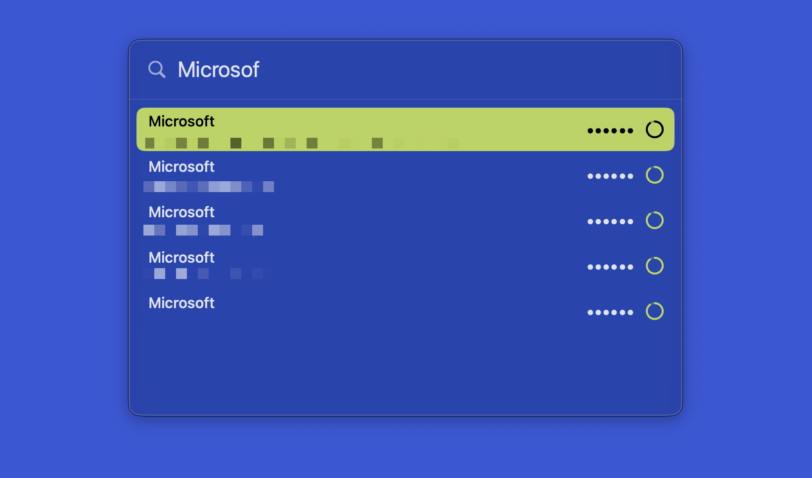

# Gans

A native macOS menu-bar client for [Ente Auth](https://ente.io/auth/) — your end-to-end
encrypted 2FA codes, one keystroke away.

**Version:** <!-- version -->1.2.0<!-- /version -->



## What it does

- **Quick Search** — press the global hotkey (default **⌃⌥Space**) to open a Spotlight-style
  search field anywhere. Type to filter, press **Return**, and Gans **types the current
  code straight into whatever field had focus**.
- **Menu bar** — click the key icon to see every entry with its live code; click an entry
  to copy the code to the clipboard.

## Permissions

- **Accessibility** — required *only* to type/paste a code into another app from Quick
  Search. Copying from the menu needs nothing. Grant it in Settings.
- The global hotkey uses Carbon and needs no special permission.

## Install

Download the latest `.dmg` from [Releases](https://github.com/L-K-M/Gans/releases). The
app is **unsigned** (no Developer ID / notarization), so on first launch run 
`xattr -dr com.apple.quarantine /Applications/Gans.app`

## Build

```bash
# Requires Xcode 16.2+. Swift packages (swift-sodium, BigInt) resolve automatically.
xcodebuild -project Gans.xcodeproj -scheme Gans -destination 'platform=macOS' build

# or an incremental Release build that reveals the product in Finder:
./scripts/build.sh

# --clean resets the wedged Swift Build service and does a full clean rebuild:
./scripts/build.sh --clean
```

## Dependencies

- [swift-sodium](https://github.com/jedisct1/swift-sodium) — libsodium (Argon2id,
  secretbox, sealed box, secretstream). Gans uses the `Clibsodium` C API directly.
- [attaswift/BigInt](https://github.com/attaswift/BigInt) — big-integer math for SRP-6a.

## Releasing

```bash
scripts/release.sh 1.2.0 --push    # bump version, tag v1.2.0, push → CI builds & publishes
```

See [CICD.md](CICD.md) for the pipeline.

## License

[The Unlicense](LICENSE) — public domain.
